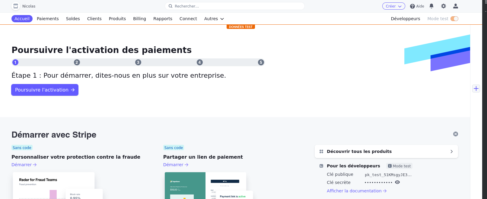

# Jam Project

## Déploiement

Copier le contenu du .env :                       
```env
APP_ENV=dev
APP_SECRET=fb079507c87c63668740516e586e4f00
MESSENGER_TRANSPORT_DSN=doctrine://default?auto_setup=0
DATABASE_URL="postgresql://user:secret@db:5432/shop?serverVersion=13&charset=utf8"
CORS_ALLOW_ORIGIN='^https?://(localhost|127\.0\.0\.1)(:[0-9]+)?$'
```                              

Copier le contenu du .env.local :                               
```env
DATABASE_URL="postgresql://user:secret@db:5432/shop?serverVersion=14&charset=utf8"
STRIPE_API_KEY=sk_test_51NpqCfD8UxwFmlxO8vn9TUrowJwKsC469YYeOqCsBOqrFsYTVQtmMGr4tH8WsIGKxNjiHuyuvRhAZvUzLz6e1jeI00bdsFaR6J
```              

Pour lancer l'application : `docker-compose up --build -d`                              
Pour initialiser la base de données effectuer les commandes suivantes :                             
- `docker-compose exec api php bin/console doctrine:database:drop --force`              
- `docker-compose exec api php bin/console doctrine:database:create`              
- `docker-compose exec api php bin/console doctrine:migration:migrate`              
- `docker-compose exec api php bin/console doctrine:fixtures:load`         

## Développement  

Pour accéder au terminal d'un container docker : `docker-compose exec {nom du service} bash`         

Pour se connecter à la base de données :                       
- Accéder au terminal du service db              
- `su postgres`                      
- `psql -U user -d shop`               
- Pour display la db existante : `\l`                
- Pour display les tables : `\dt`       

## Description
Projet e-commerce de confitures avec panier, espace d'administration et filtres avancés.

### Technologies employées :
- Symfony 6.2
- Webpack encore
- EasyAdmin 
- Stripe
<br>

### Pré-requis :
- Avoir PHP >=8.1 installé.
- Avoir installé composer
- Avoir installé le CLI symfony

Aide à l'installation à la fin de ce README.

Pour vérifier vos versions :
```bash
php -v
composer -v
```

### Webpack encore
3 entrées permettent respectivement de :
- ajouter au panier en AJAX, 
- faire des recherches en AJAX, 
- faciliter le filtre du contenu sur la page produits.


## Quick start

### 1. Démarrez par vous créer un compte Stripe sur https://dashboard.stripe.com/ <br>
Lorsqu'il vous sera demandé vos informations sur : https://dashboard.stripe.com/account/onboarding/business-structure

Il vous suffit de cliquer sur continuer, vous n'avez rien de plus à remplir pour rendre effectif votre compte.
<br><br>
Puis, <br>
Allez sur  https://dashboard.stripe.com/test/dashboard Votre clé secrète se trouve en bas à droite sur votre dashboard. Ciquez sur l'oeil pour la découvrir.


### 2. Dans /.env.local :<br>
Mettre à jour ses identifiants de connexion MySql et sa secretkey de Stripe

### 3. Console
Enfin, installez les dépendances, créez votre base de données et remplissez la des fixtures grâce aux commandes suivantes :
```
composer install
npm install
npm run build
php bin/console doctrine:database:create
php bin/console make:migration
php bin/console doctrine:migration:migrate
php bin/console doctrine:fixtures:load
symfony server:start
```
Les fixtures permettent de créer les produits, les catégories et un utilisateur Admin.

Accès à la page d'accueil : <br>
http://localhost:8000 <br>

Accès au tableau de bord d'administration : <br>
http://localhost:8000/admin <br>
Login : admin@admin.com<br>
Pass : ilovejam<br>


## Ressources
### Installer Composer 
1. Windows <br>
https://getcomposer.org/Composer-Setup.exe


2. Mac ou Linux<br>
```
php -r "copy('https://getcomposer.org/installer', 'composer-setup.php');"
php -r "if (hash_file('sha384', 'composer-setup.php') === '906a84df04cea2aa72f40b5f787e49f22d4c2f19492ac310e8cba5b96ac8b64115ac402c8cd292b8a03482574915d1a8') { echo 'Installer verified'; } else { echo 'Installer corrupt'; unlink('composer-setup.php'); } echo PHP_EOL;"
php composer-setup.php
php -r "unlink('composer-setup.php');"
mv composer.phar /usr/local/bin/composer
```


### Installation CLI SYMFONY
1. Windows<br>
https://github.com/symfony-cli/symfony-cli/releases/download/v5.4.2/symfony-cli_windows_amd64.zip <br>
Dézipper dans le dossier de votre choix et ajouter le path du dossier dans le Path des variable d'environnement système
   <br><br>
2. Mac ou Linux<br>
```
wget https://get.symfony.com/cli/installer -O - | bash
mv /Users/VOTRENOM/.symfony5/bin/symfony /usr/local/bin/symfony
```
